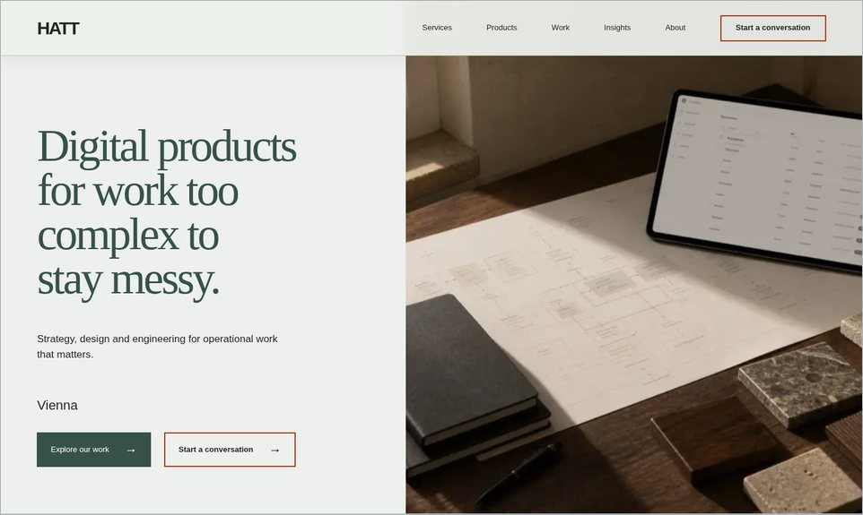
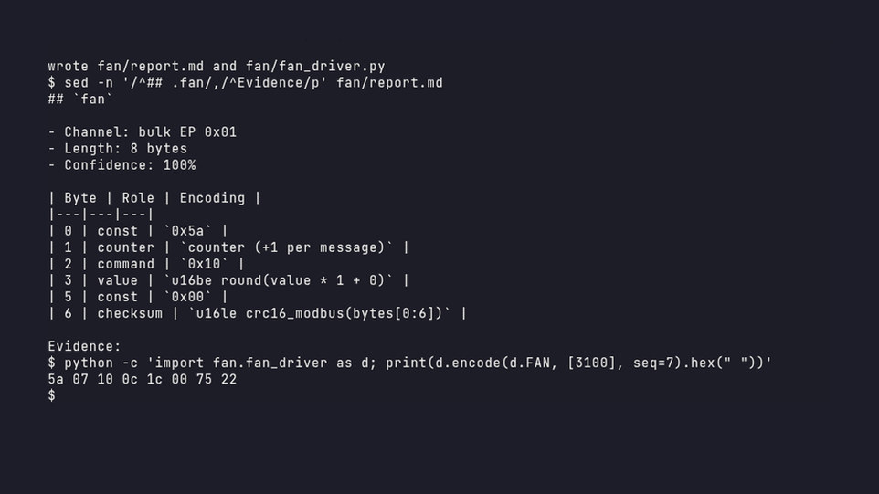
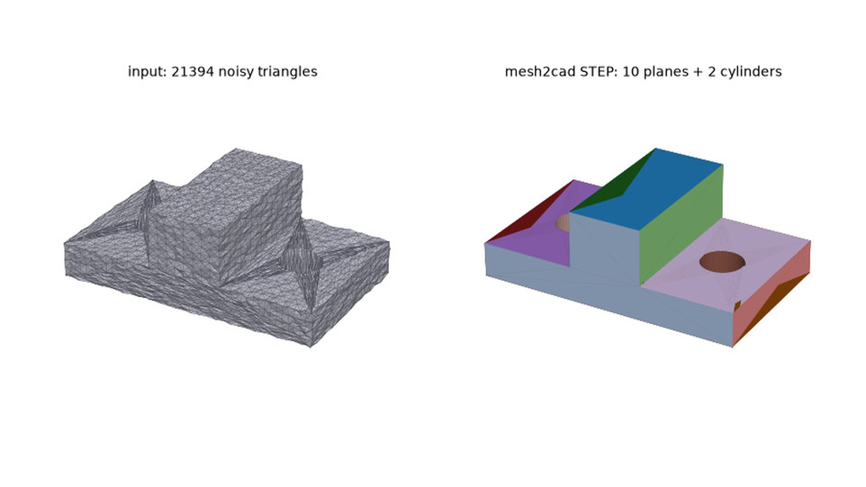
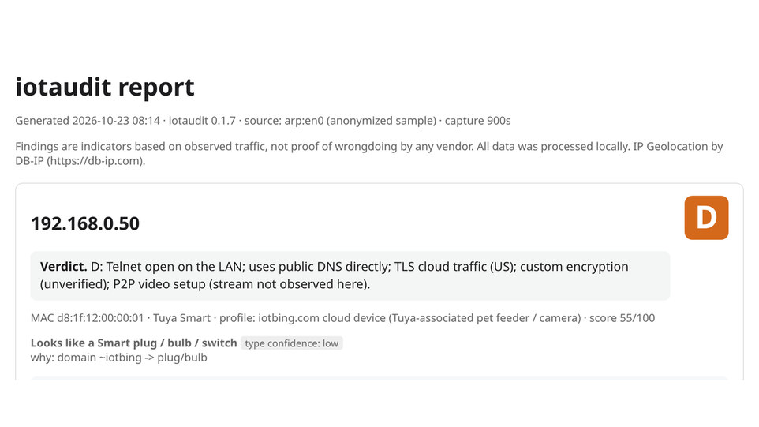
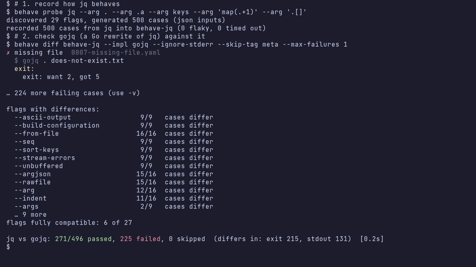
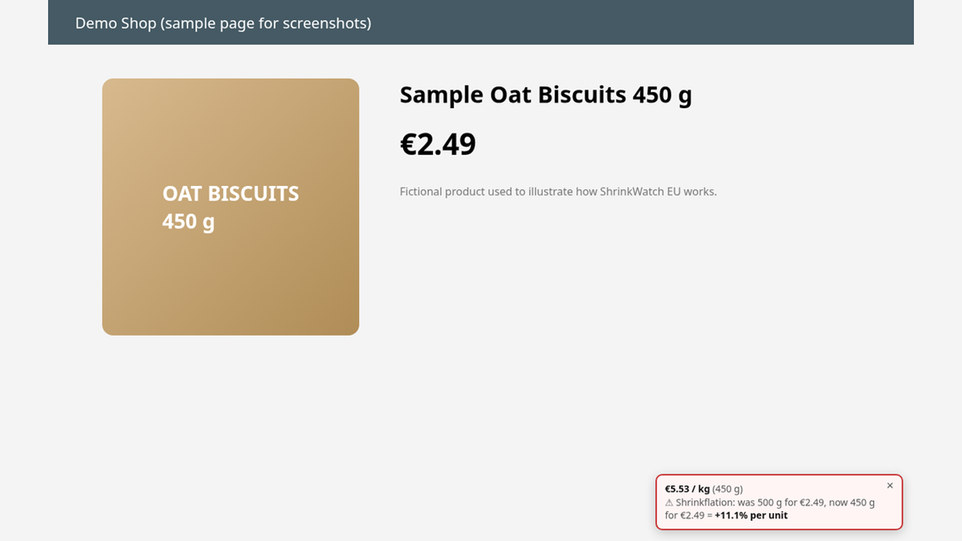

<!-- hero:start -->

  

<!-- hero:end -->

<b>Building banking systems by day, open-source tools by night.</b>

The screen is <a href="https://emirmrkaljevic.github.io/panelos-site/">PanelOS</a>, the Windows app I'm building for the small USB screens people put in PC cases. Here it shows my GitHub numbers instead of CPU temps, rendered every morning with the app's own theme code. The bottom row links out.

 If you find this useful, you can support me by getting a SkinToScan pack, my other project. It's a one-time purchase that directly funds my open-source work.

  

### What I run

<table>
  <tr>
    <td width="50%" valign="top">
      
      
<b><a href="https://hatt.at">HATT</a></b> My product studio. Focused software for operations, funding and health work, the kind that's too complex to live in spreadsheets.

    </td>
    <td width="50%" valign="top">
      
      
<b><a href="https://skintoscan.com">Skin to Scan</a></b> Upload a photo of a mole and a CNN gives you a screening result. It's for awareness, not a diagnosis, and it tells you that. I founded it and built it.

    </td>
  </tr>
</table>

### On the side

- **[TinyRex](https://apify.com/tinyrex)**: a dozen pay-per-result scrapers on Apify for job boards, Shopify and WooCommerce stores, and EU and US tenders. [Guides and examples](https://emirmrkaljevic.github.io/tinyrex-data-tools/).
- **[PanelOS](https://emirmrkaljevic.github.io/panelos-site/)**: the app on that screen. It drives the small USB screens people put in PC cases: temps, load, and whatever Spotify is playing.

### Open source

<table>
  <tr>
    <td width="50%" valign="top">
      
      
<b><a href="https://github.com/emirmrkaljevic/usb-rea">usb-rea</a></b>  
      point it at a USB gadget that only works with a vendor app. It captures the traffic, works out the protocol and writes an open Python/libusb driver. CLI and MCP server.

    </td>
    <td width="50%" valign="top">
      
      
<b><a href="https://github.com/emirmrkaljevic/mesh2cad">mesh2cad</a></b>  
      turns a scanned or printed STL mesh back into an editable STEP CAD model with exact planes, cylinders and spheres. CLI and MCP server.

    </td>
  </tr>
  <tr>
    <td width="50%" valign="top">
      
      
<b><a href="https://github.com/emirmrkaljevic/iotaudit">iotaudit</a></b>  
      audit your own smart-home devices (who they talk to, encryption, open ports, idle uploads, A to F grade report). CLI and MCP server.

    </td>
    <td width="50%" valign="top">
      
      
<b><a href="https://github.com/emirmrkaljevic/behave">behave</a></b>  
      records how a CLI behaves (flags, stdin, exit codes, edge cases) so you can check that your Rust or Go rewrite does the same. Go, CLI and MCP server.

    </td>
  </tr>
  <tr>
    <td width="50%" valign="top">
      
      
<b><a href="https://github.com/emirmrkaljevic/shrinkwatch-eu">shrinkwatch-eu</a></b> 
      a Chrome and Firefox extension that shows price per kg or litre and flags shrinkflation on EU and Balkan supermarket shops (<a href="https://github.com/emirmrkaljevic/shrinkwatch-eu/releases/tag/v0.3.17">v0.3.17</a>, Edeka DE). <a href="https://addons.mozilla.org/en-US/firefox/addon/shrinkwatch-eu/">Firefox Add-ons</a>

    </td>
    <td width="50%" valign="top">
      
      
<b><a href="https://github.com/emirmrkaljevic/truediscount">truediscount</a></b> 
      a Chrome and Firefox extension that checks if a shop discount is real against the last 30 days (EU Omnibus). Price graph, watchlist, data stays in the browser (v0.13.4). <a href="https://addons.mozilla.org/en-US/firefox/addon/truediscount/">Firefox Add-ons</a>

    </td>
  </tr>
</table>

### Contributions

- **[uutils coreutils](https://github.com/uutils/coreutils)** (Rust rewrite of GNU coreutils): [30 merged PRs](https://github.com/uutils/coreutils/pulls?q=is%3Apr+author%3Aemirmrkaljevic+is%3Amerged), [37 bugs](https://github.com/uutils/coreutils/issues?q=is%3Aissue+author%3Aemirmrkaljevic) found with [behave](https://github.com/emirmrkaljevic/behave).
- **[ESPnet](https://github.com/espnet/espnet)** (CMU speech toolkit): [9 merged PRs](https://github.com/espnet/espnet/pulls?q=is%3Apr+author%3Aemirmrkaljevic+is%3Amerged), `use_sdpa` support and attention fixes.
- **[Trafilatura](https://github.com/adbar/trafilatura)** (Python web text extraction): [4 merged PRs](https://github.com/adbar/trafilatura/pulls?q=is%3Apr+author%3Aemirmrkaljevic+is%3Amerged), extraction and parsing fixes.
- **[uutils diffutils](https://github.com/uutils/diffutils)** (Rust rewrite of GNU diffutils): [4 merged PRs](https://github.com/uutils/diffutils/pulls?q=is%3Apr+author%3Aemirmrkaljevic+is%3Amerged), GNU compatibility fixes.
- **[webvtt-py](https://github.com/glut23/webvtt-py)** (WebVTT captions for Python): [3 merged PRs](https://github.com/glut23/webvtt-py/pulls?q=is%3Apr+author%3Aemirmrkaljevic+is%3Amerged), caption parsing fixes.
- **[uutils procps](https://github.com/uutils/procps)** (Rust rewrite of procps): [2 merged PRs](https://github.com/uutils/procps/pulls?q=is%3Apr+author%3Aemirmrkaljevic+is%3Amerged), sysctl flag handling and pmap `-XX`.
- **[uutils sed](https://github.com/uutils/sed)** (Rust rewrite of GNU sed): [1 merged PR](https://github.com/uutils/sed/pulls?q=is%3Apr+author%3Aemirmrkaljevic+is%3Amerged), comment parsing after a command.
- **[uutils findutils](https://github.com/uutils/findutils)** (Rust rewrite of GNU findutils): [1 merged PR](https://github.com/uutils/findutils/pulls?q=is%3Apr+author%3Aemirmrkaljevic+is%3Amerged), xargs `-I` handling.
- **[Kando](https://github.com/kando-menu/kando)** (cross-platform pie menu): [1 merged PR](https://github.com/kando-menu/kando/pulls?q=is%3Apr+author%3Aemirmrkaljevic+is%3Amerged).

Curated lists (28)

- **[TensorBlock awesome-mcp-servers](https://github.com/TensorBlock/awesome-mcp-servers)**: 5 merged ([#3825](https://github.com/TensorBlock/awesome-mcp-servers/pull/3825), [#3944](https://github.com/TensorBlock/awesome-mcp-servers/pull/3944), [#3955](https://github.com/TensorBlock/awesome-mcp-servers/pull/3955), [#4905](https://github.com/TensorBlock/awesome-mcp-servers/pull/4905), [#5444](https://github.com/TensorBlock/awesome-mcp-servers/pull/5444)), listing mesh2cad, usb-rea, behave, iotaudit and tinyrex-mcp.
- **[awesome-mcp-list](https://github.com/MobinX/awesome-mcp-list)**: 4 landed ([#840](https://github.com/MobinX/awesome-mcp-list/pull/840), [#889](https://github.com/MobinX/awesome-mcp-list/pull/889), [#1000](https://github.com/MobinX/awesome-mcp-list/pull/1000), [#1211](https://github.com/MobinX/awesome-mcp-list/pull/1211)), iotaudit, usb-rea and mesh2cad (direct commits for conflicts).
- **[awesome-mcp-servers](https://github.com/punkpeye/awesome-mcp-servers)**: 2 merged ([#16364](https://github.com/punkpeye/awesome-mcp-servers/pull/16364), [#16367](https://github.com/punkpeye/awesome-mcp-servers/pull/16367)), usb-rea and mesh2cad.
- **[awesome-reverse-engineering](https://github.com/morluto/awesome-reverse-engineering)**: 1 merged ([#13](https://github.com/morluto/awesome-reverse-engineering/pull/13)), usb-rea.
- **[awesome-testing](https://github.com/TheJambo/awesome-testing)**: 1 merged ([#299](https://github.com/TheJambo/awesome-testing/pull/299)), behave.
- **[awesome-iot](https://github.com/phodal/awesome-iot)**: 2 merged ([#191](https://github.com/phodal/awesome-iot/pull/191), [#193](https://github.com/phodal/awesome-iot/pull/193)), iotaudit and usb-rea.
- **[awesome-embedded-security](https://github.com/hexsecs/awesome-embedded-security)**: 1 merged ([#78](https://github.com/hexsecs/awesome-embedded-security/pull/78)), usb-rea.
- **[Awesome-REA](https://github.com/reacher-z/Awesome-REA)**: 1 landed ([#2271](https://github.com/reacher-z/Awesome-REA/issues/2271)), usb-rea.
- **[Sagargupta16 awesome-mcp-servers](https://github.com/Sagargupta16/awesome-mcp-servers)**: 5 merged ([#347](https://github.com/Sagargupta16/awesome-mcp-servers/pull/347), [#348](https://github.com/Sagargupta16/awesome-mcp-servers/pull/348), [#349](https://github.com/Sagargupta16/awesome-mcp-servers/pull/349), [#352](https://github.com/Sagargupta16/awesome-mcp-servers/pull/352), [#360](https://github.com/Sagargupta16/awesome-mcp-servers/pull/360)), usb-rea, behave, iotaudit, tinyrex-mcp and mesh2cad.
- **[awesome-security-agent-harnesses](https://github.com/Ed-Marcavage/awesome-security-agent-harnesses)**: 1 merged ([#12](https://github.com/Ed-Marcavage/awesome-security-agent-harnesses/pull/12)), usb-rea.
- **[awesome-homelab](https://github.com/Minh141120/awesome-homelab)**: 1 merged ([#16](https://github.com/Minh141120/awesome-homelab/pull/16)), iotaudit.
- **[awesome-iot-and-hardware-security](https://github.com/kayranfatih/awesome-iot-and-hardware-security)**: 2 merged ([#3](https://github.com/kayranfatih/awesome-iot-and-hardware-security/pull/3), [#4](https://github.com/kayranfatih/awesome-iot-and-hardware-security/pull/4)), usb-rea and iotaudit.
- **[OSSDrop](https://github.com/OSSDrop/OSSDrop)**: 4 merged ([#114](https://github.com/OSSDrop/OSSDrop/pull/114), [#121](https://github.com/OSSDrop/OSSDrop/pull/121), [#125](https://github.com/OSSDrop/OSSDrop/pull/125), [#130](https://github.com/OSSDrop/OSSDrop/pull/130)), behave, usb-rea, truediscount and ShrinkWatch EU.
- **[mcpHQ awesome-mcp-servers](https://github.com/mcpHQ/awesome-mcp-servers)**: 3 merged ([#752](https://github.com/mcpHQ/awesome-mcp-servers/pull/752), [#753](https://github.com/mcpHQ/awesome-mcp-servers/pull/753), [#803](https://github.com/mcpHQ/awesome-mcp-servers/pull/803)), iotaudit, behave and tinyrex-mcp.
- **[awesome-iot (HQarroum)](https://github.com/HQarroum/awesome-iot)**: 1 merged ([#165](https://github.com/HQarroum/awesome-iot/pull/165)), usb-rea.
- **[toolsdk-mcp-registry](https://github.com/toolsdk-ai/toolsdk-mcp-registry)**: 1 merged ([#1371](https://github.com/toolsdk-ai/toolsdk-mcp-registry/pull/1371)), iotaudit.
- **[personal-finance-awesome](https://github.com/ashishb/personal-finance-awesome)**: 1 merged ([#85](https://github.com/ashishb/personal-finance-awesome/pull/85)), truediscount.
- **[Awesome-MCP-ZH](https://github.com/yzfly/Awesome-MCP-ZH)**: 1 merged ([#1037](https://github.com/yzfly/Awesome-MCP-ZH/pull/1037)), usb-rea.
- **[xszn.github.io](https://github.com/xszn/xszn.github.io)**: 2 merged ([#15](https://github.com/xszn/xszn.github.io/pull/15), [#18](https://github.com/xszn/xszn.github.io/pull/18)), shrinkwatch-eu and truediscount.
- **[awesome-mcp-servers-devops](https://github.com/WagnerAgent/awesome-mcp-servers-devops)**: 1 merged ([#136](https://github.com/WagnerAgent/awesome-mcp-servers-devops/pull/136)), behave.
- **[osint_stuff_tool_collection](https://github.com/cipher387/osint_stuff_tool_collection)**: 1 merged ([#300](https://github.com/cipher387/osint_stuff_tool_collection/pull/300)), EU Grants Scraper.
- **[awesome-windows](https://github.com/thechampagne/awesome-windows)**: 1 merged ([#151](https://github.com/thechampagne/awesome-windows/pull/151)), PanelOS.
- **[awesome-consumer-protection](https://github.com/O957/awesome-consumer-protection)**: 2 merged ([#29](https://github.com/O957/awesome-consumer-protection/pull/29), [#30](https://github.com/O957/awesome-consumer-protection/pull/30)), shrinkwatch-eu and truediscount.
- **[awesome-reverse-engineer-anything](https://github.com/AIshihzong/awesome-reverse-engineer-anything)**: 1 merged ([#47](https://github.com/AIshihzong/awesome-reverse-engineer-anything/pull/47)), usb-rea.
- **[awesome-chrome](https://github.com/xyNNN/awesome-chrome)**: 1 merged ([#206](https://github.com/xyNNN/awesome-chrome/pull/206)), shrinkwatch-eu.
- **[awesome-osint-mcp-servers](https://github.com/soxoj/awesome-osint-mcp-servers)**: 1 merged ([#162](https://github.com/soxoj/awesome-osint-mcp-servers/pull/162)), TinyRex MCP.
- **[Awesome-MCP-Servers (AIAnytime)](https://github.com/AIAnytime/Awesome-MCP-Servers)**: 4 merged ([#492](https://github.com/AIAnytime/Awesome-MCP-Servers/pull/492), [#493](https://github.com/AIAnytime/Awesome-MCP-Servers/pull/493), [#499](https://github.com/AIAnytime/Awesome-MCP-Servers/pull/499), [#544](https://github.com/AIAnytime/Awesome-MCP-Servers/pull/544)), iotaudit, behave, usb-rea and TinyRex MCP.
- **[awesome-ai-reverse-engineering](https://github.com/DiscoverBox/awesome-ai-reverse-engineering)**: 1 merged ([#9](https://github.com/DiscoverBox/awesome-ai-reverse-engineering/pull/9)), usb-rea.

---

[LinkedIn](https://www.linkedin.com/in/emirmrkaljevic) · [dev.to](https://dev.to/emirmrkaljevic) · [hatt.at](https://hatt.at) · [skintoscan.com](https://skintoscan.com) · [apify.com/tinyrex](https://apify.com/tinyrex) · [PanelOS](https://emirmrkaljevic.github.io/panelos-site/)
